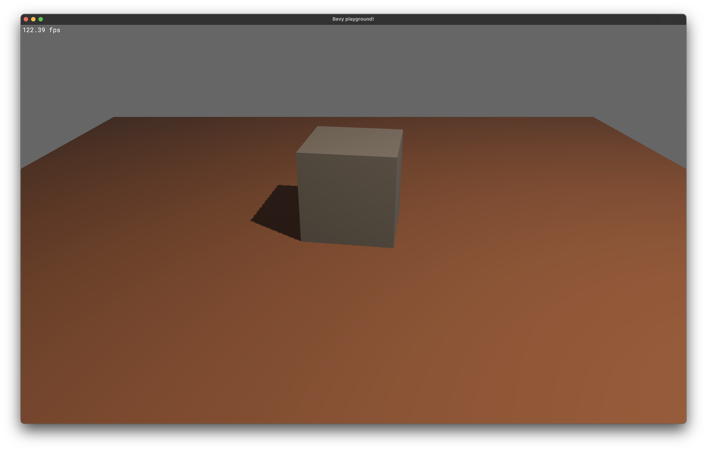

# bevy-playground



My playground for [Bevy](https://bevyengine.org).

Setup follows the recommendations of [Bevy book](https://bevyengine.org/learn/book/getting-started/setup/) regarding performance optimizations, but does not use dynamic linking.

The demo Scene is based on the [3D scene](<(https://bevyengine.org/examples/3d/3d-scene/)>) from [Bevy examples](https://bevyengine.org/examples) and adds/changes the following

- `main.rs` allows unused definitions
- Added `LogDiagnosticsPlugin`
- Added `FrameTimeDiagnosticsPlugin`
- Positions window on `WindowPosition::Centered(MonitorSelection::Number(1))`
- Shows average fps (`fps_system`)
- Rotates the cube (`rotate_system`)

The repository is meant to be a template for future Bevy projects.

## Installation and usage

To install run the following commands in terminal:

```
git clone https://github.com/synec/bevy-playground.git
cd bevy-playground
cargo run
```

I recommend [cargo-watch](https://crates.io/crates/cargo-watch) for development.

Install with `cargo install cargo-watch` and run project via `cargo watch -x run` to restart on code changes.
